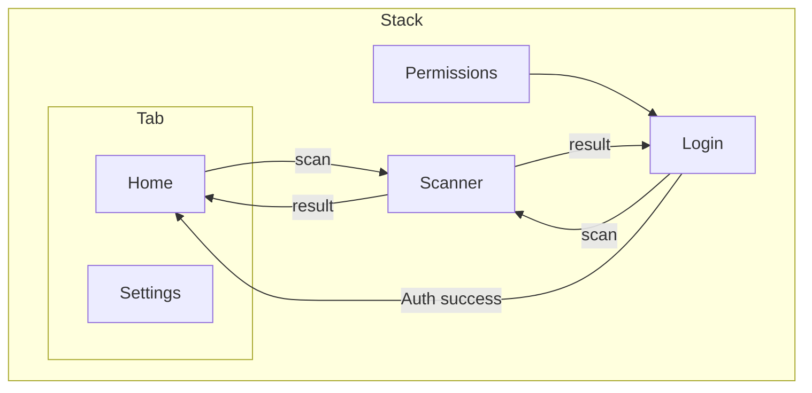
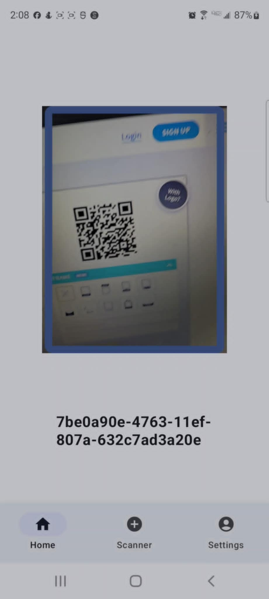
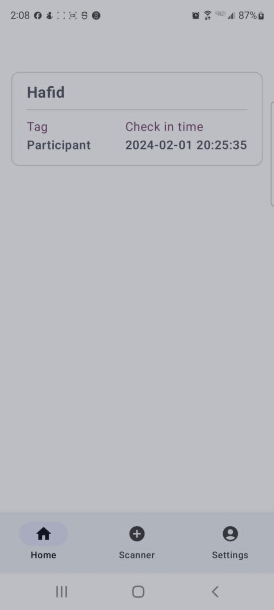

# Description

This Kotlin application is a QR-based check-in app designed for events. It is structured with a modular approach. The application is built using Jetpack Compose for the UI, Room for local database management, and Ktor for HTTP requests. It includes features like QR code scanning, authentication, and state management, allowing users to easily check in to events by scanning QR codes.
# Layout



# File Tree

```bash
.
├── composables
│   ├── AppNavigation.kt
│   ├── libs
│   │   ├── AnimationComponent.kt
│   │   ├── CustomButton.kt
│   │   ├── HistoryItem.kt
│   │   └── TextField.kt
│   ├── NavigationBar.kt
│   ├── qrCodeScanner
│   │   └── qrCodeScanner.kt
│   └── screens
│       ├── HomeScreen.kt
│       ├── LoginScreen.kt
│       ├── MainScreen.kt
│       ├── PermissionScreen.kt
│       ├── ScannerScreen.kt
│       └── SettingsScreen.kt
├── data
│   └── room
│       ├── converters
│       │   └── DateTimeConverter.kt
│       ├── Daos.kt
│       ├── Database.kt
│       └── models
│           └── models.kt
├── utils
│   └── SharedPreferenceManager
│       ├── 
├── MainActivity.kt
├── QrTypes.kt
├── remote
│   ├── api
│   │   ├── auth
│   │   │   ├── AuthServiceImp.kt
│   │   │   └── AuthService.kt
│   │   ├── check
│   │   │   ├── CheckServiceImp.kt
│   │   │   └── CheckService.kt
│   │   └── HttpRoutes.kt
│   └── dto
│       ├── auth
│       │   ├── AuthRequest.kt
│       │   └── AuthResponse.kt
│       └── check
│           ├── CheckRequest.kt
│           └── CheckResponse.kt
├── Routes.kt
└── ui
    └── theme
        ├── Color.kt
        ├── Theme.kt
        └── Type.kt
```

# Functionalities

## DRY (Don't Repeat Yourself)

The app follows the DRY principle, ensuring that code duplication is minimized. Reusable components are placed in the `composables/libs` directory, such as `AnimationComponent.kt`, `CustomButton.kt`, `HistoryItem.kt`, and `TextField.kt`. The QR code scanner is independent and returns the value read from the QR code, making it reusable across different screens. 

## Navigation

### Stack

The app uses a stack-based navigation system, managed through `AppNavigation.kt` and `Routes.kt`. This allows for a linear navigation flow, where screens are pushed onto the stack and popped off as the user navigates through the app.

### Tab

The tab-based navigation is handled within the `Tab` subgraph, allowing for easy switching between the `Home` and `Settings` screens. This is typically implemented using Jetpack Compose’s navigation component, facilitating a seamless user experience.

## State Management

State management is crucial in any application. In this app, state management is likely handled using Jetpack Compose’s state management features, such as `State`, `MutableState`, and `ViewModel`. This ensures that the UI reflects the current state of the data and responds to changes dynamically.

## Permissions

Permission handling is managed within `PermissionScreen.kt`, ensuring that the app requests and manages necessary permissions like camera access for QR code scanning. This is typically done using the `ActivityResultContracts` API in Android.

## QR Code Scanner

The QR code scanning functionality is encapsulated in `qrCodeScanner/qrCodeScanner.kt`. This module handles the scanning process, including invoking the camera, processing the scanned QR code, and returning the result to the appropriate screen. The app uses the ZXing (Zebra Crossing) library for QR code scanning.

## HTTP Requests

HTTP requests are managed using Ktor. After scanning a QR code, an HTTP request containing a magic link is sent. If the request is successful, a cookie is set for authentication. The API interfaces and implementation classes are located in the `remote/api` directory, with the `AuthService.kt` and `CheckService.kt` interfaces defining the endpoints, and `AuthServiceImp.kt` and `CheckServiceImp.kt` containing the implementation details.

## Room DB

The app uses Room for local database management. The database configuration, DAOs, and models are located in the `data/room` directory. `Database.kt` contains the database setup, `Daos.kt` defines the data access objects, and `models/models.kt` includes the data models.

## Authentication and Authorization

Authentication and authorization are handled within the `remote/api/auth` directory. The `AuthService.kt` interface defines the authentication endpoints, while `AuthServiceImp.kt` implements the authentication logic. DTOs for authentication requests and responses are defined in `dto/auth`.

# Styling

## Jetpack Compose

The UI is built using Jetpack Compose, which allows for a declarative approach to building user interfaces. Composable functions and UI components are located in the `composables` directory, making the code modular and reusable.

## Dark/Light/System Themes

Styling details such as color schemes, themes, and typography are defined in the `ui/theme` directory, with files like `Color.kt`, `Theme.kt`, and `Type.kt`. This ensures a consistent look and feel across the app, leveraging Jetpack Compose’s theming capabilities to support dark, light, and system default themes.

## ScreenShots Table

Certainly! Here’s a table for screenshots corresponding to each screen in the mermaid section, excluding the subgraph groupings:

| Screen Name      | Description                              | Screenshot                                 |
|------------------|------------------------------------------|--------------------------------------------|
| Permissions      | Screen to request and manage permissions |  |
| Login            | Screen for user login                    |  |
| Scanner          | QR code scanning screen                  |  |
| Home             | Main screen after login                  |  |
| Settings         | Settings screen                          |  |
